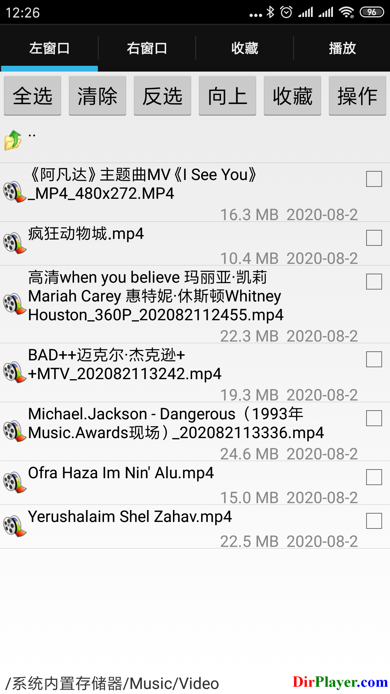
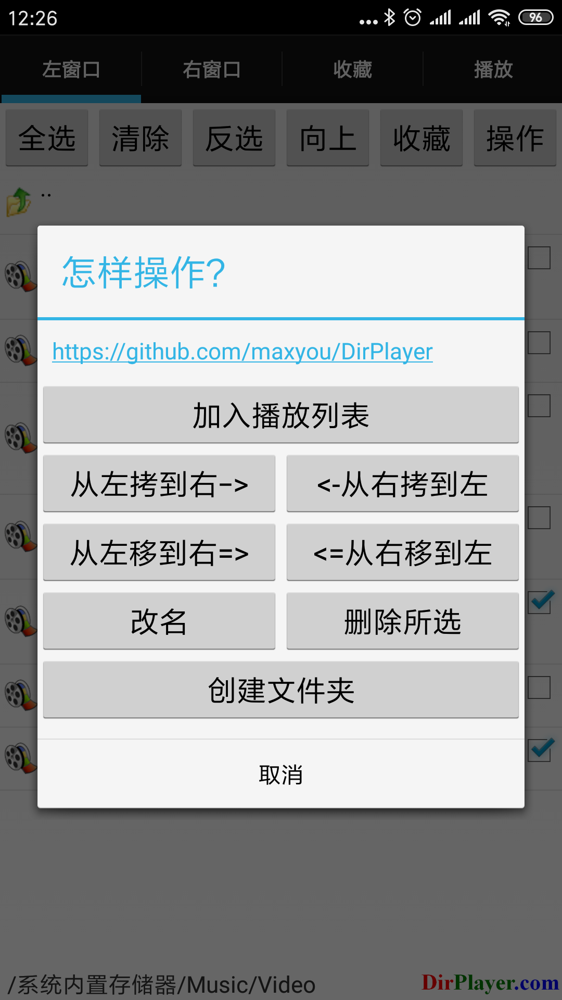
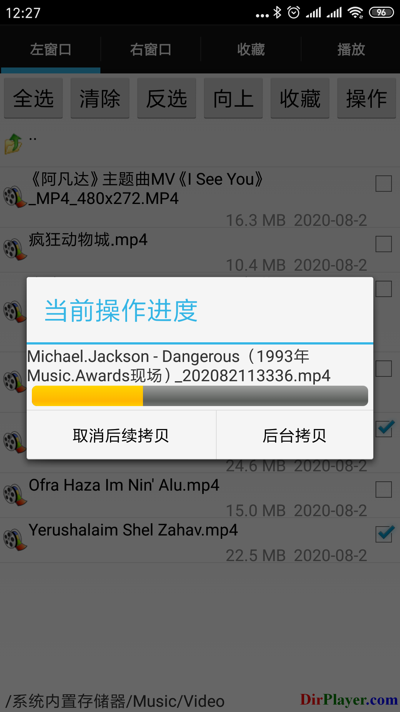
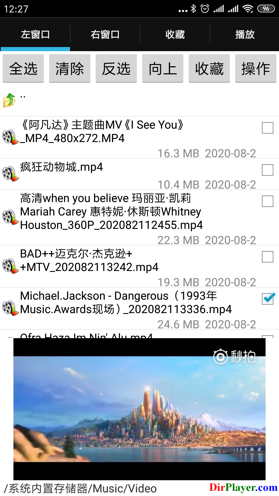
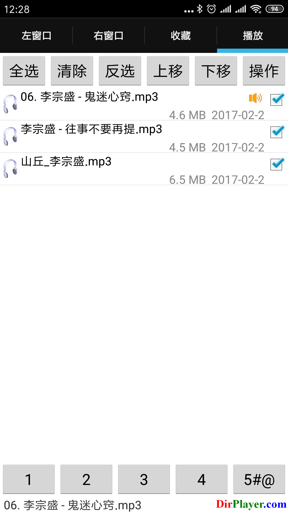
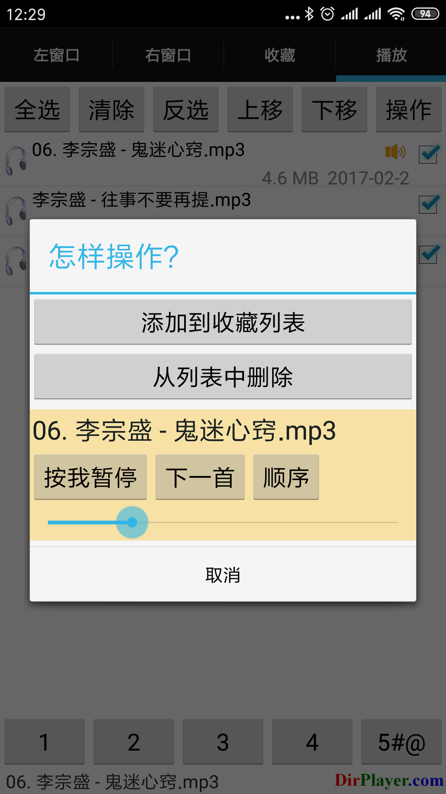

# DirPlayer

**DirPlayer** is a file manager, a music and video player.

Github: [apk](https://github.com/maxyou/DirPlayer/blob/master/DirPlayer.apk?raw=true) 
GooglePlay: [apk](https://play.google.com/store/apps/details?id=com.maxproj.android.dirplayer) 

### gif animation
![pic][1]

  [1]: https://raw.githubusercontent.com/maxyou/DirPlayer/master/ezgif.com-resize.gif

### ScreenShots

  
  
  
  
  
  

## License 
under [MIT License](http://www.opensource.org/licenses/MIT).

